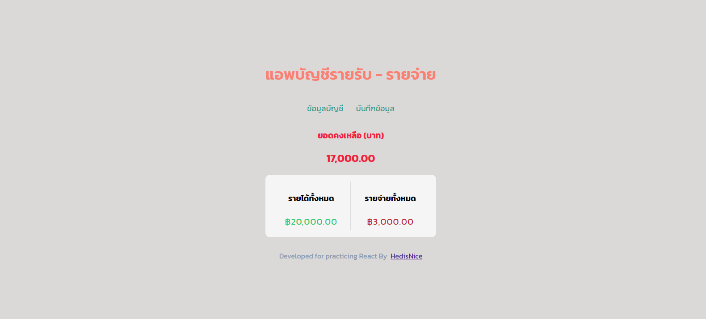

# Records-of-income-and-expenses
"This is a front-end development practice using HTML, CSS, and React to create a project named 'Expense Tracker App.' The project includes features such as adding and deleting entries, calculating income and expenses, and linking to display recorded transactions or expense records. Thank you for watching."

Links
Solution URL: [https://github.com/hedisnice/QR-Code-Challenge]

Live Site URL: [https://recordmonetbynice.netlify.app]
